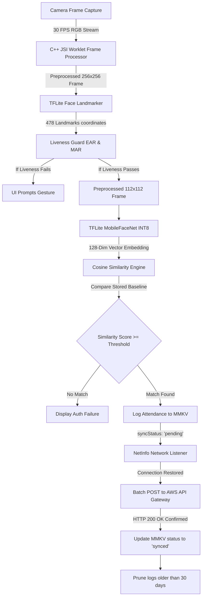

# Contributing to A.T.M.O.S

Welcome! We are excited to build **A.T.M.O.S** (Autonomous Telemetry & Mobile Offline Sync) together. This document serves as both a contribution guide and an engineering deep-dive to help you understand how the system functions under the hood before you write your first line of code.

---

## 🧠 System Architecture: How It Works

A.T.M.O.S is built with an **offline-first, zero-latency edge AI architecture**. By running all neural inferences entirely on-device, the app verifies identity and guarantees data integrity in the most remote field settings without relying on server-side computations.



### 1. Zero-Latency C++ JSI Camera Loop
Traditional React Native architectures serialize raw frames and pass them over an asynchronous JSI bridge, causing frames to drop and creating a sluggish UI. A.T.M.O.S solves this using `react-native-vision-camera` and `react-native-worklets-core`:
* **Worklets:** Camera frames are captured in native memory. A C++ Worklet interceptor invokes the neural models synchronously using `react-native-fast-tflite`.
* **Non-Blocking UI:** The inference loop executes on a separate high-priority native helper thread at 30 FPS. The main JavaScript thread is never blocked, ensuring a smooth, fluid user interface.

### 2. On-Device Facial Biometrics & Embeddings
We employ a two-stage pipeline using two heavily quantized, high-performance TFLite models:
* **Face Mesh & Landmarks (`face_landmark.tflite`):** Predicts 468/478 3D facial coordinate landmarks to track structural movement.
* **Feature Embedding (`mobilefacenet_int8.tflite`):** Generates a dense 128-dimensional floating-point vector (embedding) unique to the individual's face.
* **INT8 Quantization:** Both models are quantized from 32-bit floating point down to 8-bit integers, reducing their total combined size to under **9 MB** and ensuring compatibility with the app's tight 20MB budget constraint.

### 3. Anti-Spoofing Liveness Guard (EAR & MAR)
To ensure physical presence and prevent photo/cardboard-cutout spoofing attacks, we calculate real-time geometric ratios on the local coordinate outputs:
* **Eye Aspect Ratio (EAR):** Tracks the ratio of vertical eye eyelids distance to horizontal eye width:
  $$\text{EAR} = \frac{\|p_2 - p_6\| + \|p_3 - p_5\|}{2 \cdot \|p_1 - p_4\|}$$
  If the average EAR across both eyes drops below the threshold (typically `0.20`), a blink gesture is confirmed.
* **Mouth Aspect Ratio (MAR):** Tracks mouth open-ness to detect positive smiles:
  $$\text{MAR} = \frac{\|p_{top} - p_{bottom}\|}{\|p_{left} - p_{right}\|}$$
* **Challenge Flow:** On startup, the engine issues a random challenge (e.g., "Please Blink" or "Please Smile"). Face recognition is only executed *after* liveness validation is successful.

### 4. Cosine Similarity Engine
Once liveness is verified and an embedding vector is extracted, it is matched against the locally registered employee dataset using **Cosine Similarity**:
$$\text{Similarity} = \frac{A \cdot B}{\|A\| \|B\|}$$
* Since the embeddings are normalized vectors, the cosine similarity returns a value between `0` and `1`.
* If the best-matched score is above the configured threshold (e.g. `0.85`), the employee is successfully authenticated.

### 5. Resilient Local MMKV Sync Queue
* **High-Speed Store:** Instead of slow asynchronous databases, A.T.M.O.S utilizes `react-native-mmkv`—a synchronous C++ key-value engine (~30x faster than AsyncStorage).
* **Sync Mechanism:** Attendance records are locally saved with a `syncStatus: 'pending'` flag. 
* **State Retention & Pruning:** A `NetInfo` hook monitors network status. When internet is restored, all pending records are batch-posted to the centralized AWS API Gateway. Upon successful sync (HTTP 200 OK), records are marked as `'synced'` in MMKV so they are retained in the local UI logs history. Records older than 30 days are automatically pruned from the device to conserve disk space.

---

## 🛠️ Local Development Setup

Follow these steps to configure your environment:

1. **Clone the Repository:**
   ```sh
   git clone https://github.com/BinaryCoder3012/ATMOS.git
   cd ATMOS/DataLake3FaceAuth
   ```
2. **Install Dependencies:**
   ```sh
   npm install
   ```
3. **Environment Setup:** Ensure your local environment variables (`ANDROID_HOME`, `JAVA_HOME`) are pointing to your Android SDK and JDK paths. Duplicate `.env.example` to `.env` and fill in local variables.

---

## 🌿 Branching & Commits

* **Branches:** Always create a feature or bugfix branch for your work (e.g., `feat/liveness-checks` or `fix/camera-crash`). Do not push directly to the `main` branch.
* **Commit Messages:** Write clear, descriptive commits. We recommend standard formats like `feat(auth): ...` or `fix(camera): ...` to keep the history clean.

---

## 💎 Code Quality

* **Formatting:** Run `npm run lint` before committing to format the codebase and check for style issues.
* **Types:** Use TypeScript properly. Avoid using `any` to keep type safety strong across all components.

---

## 🚀 Submission Process

1. Keep your branch updated with `main`.
2. Push your branch to the remote repository.
3. Open a Pull Request (PR) against `main`, and provide a quick description of the changes you made.

